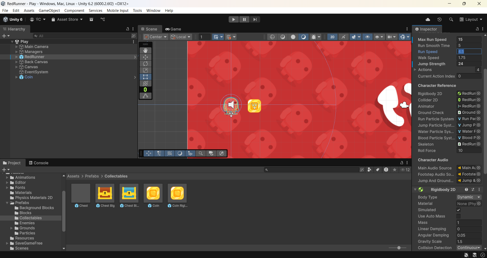

# Lab 01 - Khám phá dự án RedRunner
## Thông tin sinh viên
- **Họ tên**: Chung Thiện Ý
- **MSSV**: 2312804
- **Lớp**: CTK47C
## Mô tả
Bài thực hành Lab 01 môn **Game 2D Development with Unity**.
Khám phá và phân tích dự án game RedRunner - một Platformer 2D mã nguồn mở
được phát triển bởi Bayat Games.
## Các thay đổi đã thực hiện
1. Thay đổi tốc độ chạy: 8 → 15
2. Thay đổi lực nhảy: 12 → 24
3. Thay đổi trọng lực: 1.5 → 0.5 và 3.0
4. Thêm Coin vào scene tại vị trí Scenes Play.unity
## Screenshots

## Kiến thức đã học được
1. Khám phá cấu trúc project RedRunner
2. Phân tích Scene, Prefab, Scripts, UI
3. Tìm hiểu GameManager, Character, Enemy
4. Thay đổi thông số gameplay
5. Thêm Coin vào Scene